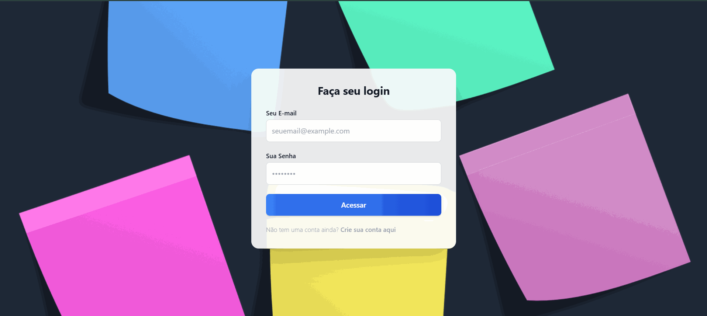
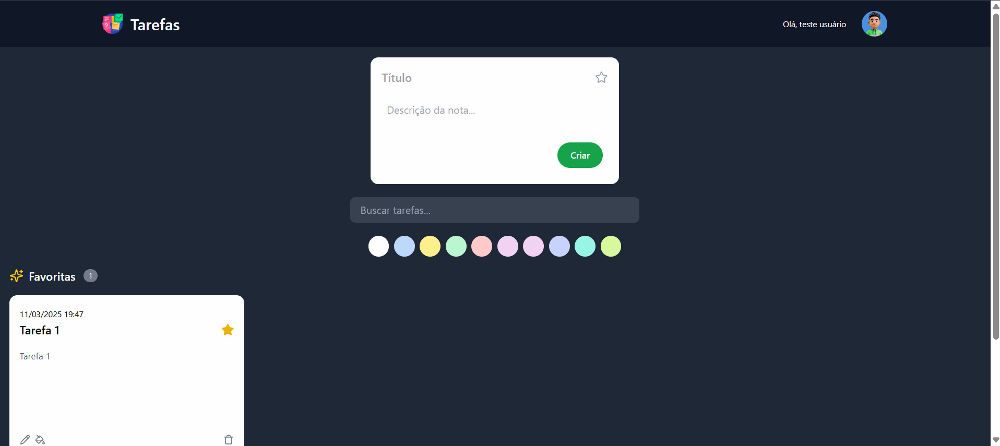
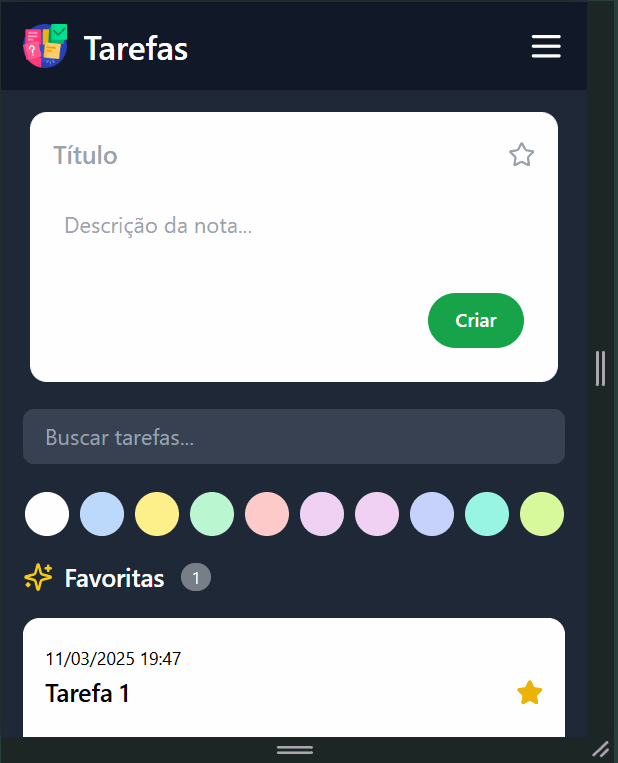

# Instruções para Clonar e Configurar o Projeto

## Clonar Repositórios

```bash
git clone https://github.com/ricardochomicz/task-api.git
git clone https://github.com/ricardochomicz/task-app.git
```

# Configuração da API

## Acessar a Pasta da Aplicação e Configurar Variáveis de Ambiente

```bash
cd task-api
cp .env.example .env

# Configurar as variáveis de ambiente no arquivo .env
DB_CONNECTION=mysql
DB_HOST=db
DB_PORT=3306
DB_DATABASE=taskdb
DB_USERNAME=user
DB_PASSWORD=pass
```

## Construir a Imagem e Rodar o Container

```bash
docker-compose up -d
docker exec -it task-api bash
composer install
php artisan key:generate
php artisan migrate
```

# Configuração do Frontend

## Acessar a Pasta da Aplicação (Local)

```bash
cd task-app
npm install --legacy-peer-deps
npm start
```

## Construir a Imagem e Rodar o Container

```bash
cd task-app
docker build -t task-app .
docker run -p 3000:80 task-app
```

# Acessar a Aplicação

Acesse a aplicação no navegador:

[http://localhost:3000](http://localhost:3000)

# Executar Testes API

Para executar os testes, use o seguinte comando:

```bash
cd task-api
php artisan test
```

## Executar Teste APP

Para executar os testes, use o seguinte comando:

```bash
cd task-app
npx jest
```

# Utilizar o Sistema

Assista ao vídeo abaixo para ver como utilizar o sistema:

[Assistir](https://youtu.be/4P6oRjyOpao)

# Telas do Sistema



